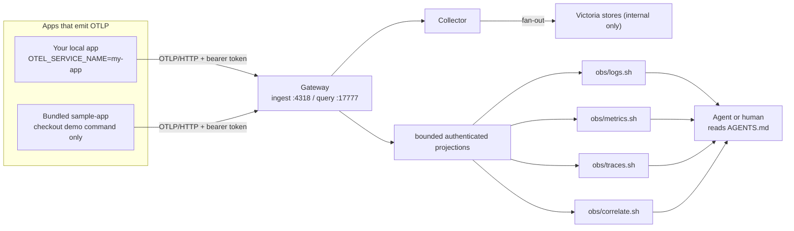
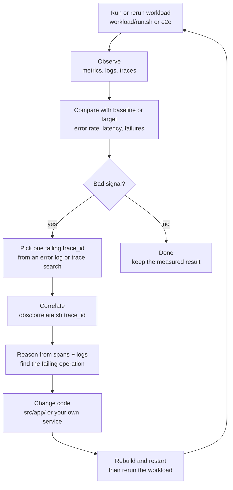
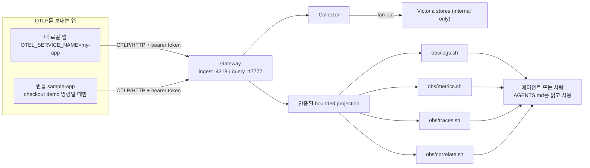
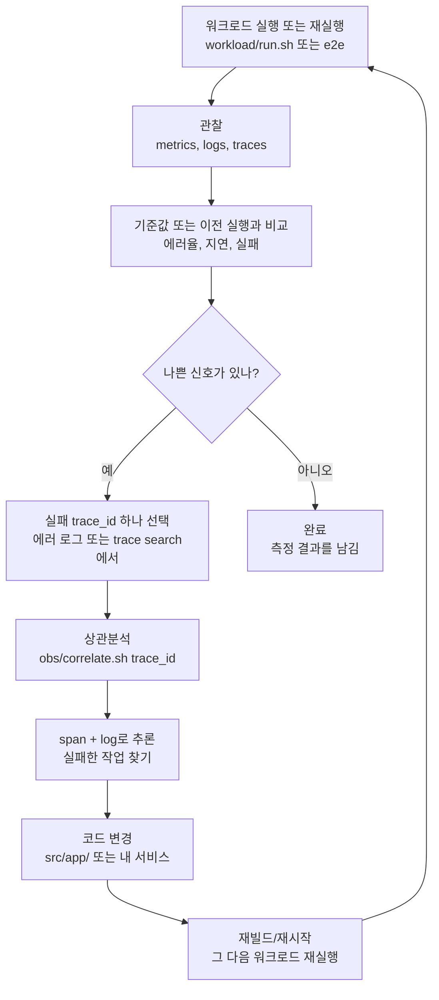

# AgentOTelStack

> **[English](#english) · [한국어](#한국어)**

A local observability stack for AI coding agents (**Claude Code · Codex ·
OpenCode …**) and humans. One shared, Docker-based backend for
**logs · metrics · traces**, with an **observe -> reason -> change -> re-run**
feedback loop driven by plain `curl` query tools. No SDK needed to *read*
telemetry — any agent reads `AGENTS.md` and uses the same `obs/*.sh` tools.

---

## English

The local Gateway is the public edge: OTLP ingest is `127.0.0.1:4318` and
authenticated query helpers use `127.0.0.1:17777`. VictoriaLogs, VictoriaMetrics,
and VictoriaTraces are internal backends. See [`docs/ARCHITECTURE.md`](./docs/ARCHITECTURE.md),
[`docs/CONNECT.md`](./docs/CONNECT.md), and [`docs/JSON_CONTRACT.md`](./docs/JSON_CONTRACT.md).

A self-contained observability backend you run once on your machine. Any number
of your own apps point at the authenticated Gateway over OTLP/HTTP
(`http://127.0.0.1:4318`); everything
lands in the same stores and is queried side by side. The agent (or you) reads
telemetry back through `./obs/*.sh`.

### Architecture

Read this left to right: apps write telemetry into the Gateway; agents read it
back through the query scripts on the authenticated query port `:17777`.



- The **Gateway** is the only host-facing ingest edge. The internal collector is
  the fan-out point and is not an app connection target.
- **Gateway** is the only query surface. `obs/*` uses bounded authenticated
  projections and does not accept raw backend query syntax or backend URLs.

### The feedback loop

The loop is not just "look at logs". Metrics tell you whether something is
wrong; logs and traces tell you which request and code path explain it.



### Why

What an agent (or a human) editing code lacks most is **fact-based feedback on
whether a change actually worked**. Logs alone are fragmentary; metrics alone
tell you *what* broke but not *where* or *why*. This stack:

- **Unifies the three signals** in one backend, so they connect to each other.
- **Pivots across signals on `trace_id`** — "error rate spiked" (metric) →
  "this request failed" (log) → "this span in this code path returned 500"
  (trace), all at once. (`./obs/correlate.sh`)
- **Needs no SDK to read** — just `curl` wrappers (`./obs/*.sh`). Any agent
  reads `AGENTS.md` and runs the same loop with the same tools.
- **Is shared by every local project once it's up** — give each app a different
  `OTEL_SERVICE_NAME` and they all report into the same backend and are queried
  side by side.

### What you get

With this stack attached you can answer, in **numbers** (see [Verified](#verified)):

- **Error rate** — `sum(...{outcome="error"}) / sum(...)` → e.g. 18.7%
- **Latency distribution** — `histogram_quantile(0.95, ...)` → e.g. p95 4.75s
- **Failure localization** — from a failed request's trace, instantly see which
  span (`GET /api/checkout`) carried `http.status_code=500`
- **Before/after comparison** — after a fix, re-run the same workload and verify
  the error rate / latency actually dropped

So instead of "I think I fixed it", you say **"error rate 18.7% → 0%"**.

### Verified

> Actual run results, not claims.

Booted the full stack with the checkout demo command, drove load with `./workload/run.sh 150`,
then queried all four tools:

| Check | Result |
|---|---|
| Stack boot (historical run) | 5 containers (collector + Victoria ×3 + sample-app) all healthy; this predates the Gateway runtime |
| **Write path** | app → collector → all 3 stores receiving (success 54 / error 12) |
| **Read path** | `logs.sh` / `metrics.sh` / `traces.sh` / `correlate.sh` all returned real data |
| **Correlation** | error log (`checkout failed` + trace_id) → `correlate.sh` → same trace's `GET /api/checkout` span showed `http.status_code=500`, `error=true`, 17.4ms |
| Effect metrics | error rate 18.7%, p95 4.75s |
| External app | historical evidence: a second app appeared alongside `sample-app`; current path additionally requires the Gateway ingest token |

The measurements above are historical evidence from an earlier five-container
run, not a claim that the current runtime has five services or unauthenticated
collector access. Re-run the commands below for current evidence.

Reproduce in [Reproduce](#reproduce).

### Prerequisites

- **Docker** (Docker Desktop or Engine) — runs the Gateway, collector, stores, and
  optional demo app.
- **`jq`** — the `./obs/*.sh` query scripts use it to pretty-print JSON
  (`brew install jq` / `apt install jq`).
- **`make`** *(optional)* — convenience wrapper. Use `./bin/obs compose ...`
  when invoking Compose directly so the credential store is loaded.
- Your app must emit **OTLP**. If it doesn't yet, see
  [docs/CONNECT.md](./docs/CONNECT.md) (Node / Python / Java / Go).

### Versioned release install (2.1.0)

The stable release is published as an immutable tag and two release assets: a
source tarball and its SHA-256 checksum. Always download and verify the
checksum before extracting or installing; do not substitute a moving branch
archive or an asset from another tag.

```bash
VERSION=2.1.0
BASE="https://github.com/gkrtjd99/AgentOTelStack/releases/download/v${VERSION}"
curl -fLO "${BASE}/AgentOTelStack-v${VERSION}.tar.gz.sha256"
curl -fLO "${BASE}/AgentOTelStack-v${VERSION}.tar.gz"
sha256sum --check "AgentOTelStack-v${VERSION}.tar.gz.sha256"
tar -xzf "AgentOTelStack-v${VERSION}.tar.gz"
cd "AgentOTelStack-v${VERSION}"
make install VERSION="${VERSION}"
obs setup
obs up
```

When using a mirror, use that mirror's owner/name in `BASE`. Release tags and
assets are never moved or overwritten;
the checksum detects download/storage corruption and confirms the tarball
matches its paired asset. The GitHub tag/release is the trust boundary; a
checksum downloaded from an untrusted mirror cannot establish provenance by
itself.

For development, clone a branch or an immutable tag and use the checkout
launcher with `AGENTOTEL_DEV_MODE=1`; this deliberately exercises source files
and is separate from the clone-independent release install. Before replacing
an existing checkout or runtime, copy `.agentotel/project.toml` somewhere safe
and restore it afterward to preserve that project's telemetry identity.

### Current install, MCP, and safety contract

Install a self-contained, versioned runtime from a clone with `make install
VERSION=2.1.0`. It lives at `~/.local/share/agentotel/2.1.0` (or the XDG data
directory), with `current` and `previous` pointers; `~/.local/bin/obs runtime
rollback` returns to the previous version. Launchers use the installed assets,
not the clone, so the checkout may be moved or removed. Credentials are created
with restrictive permissions (ingest token, query token, and Grafana password)
and are kept outside source control. Compose targets load them without printing
secrets; `./bin/obs credentials ensure` also initializes a source checkout. See
[`docs/AGENT_SETUP.md`](./docs/AGENT_SETUP.md).

The installed adapter exposes exactly three read-only MCP tools:
`agentotel_context`, `agentotel_correlate`, and `agentotel_services`. They use
fixed, bounded queries through the authenticated Gateway; they cannot select an
arbitrary URL or write telemetry. Configure the installed binary at
`${XDG_DATA_HOME:-$HOME/.local/share}/agentotel/current/bin/agentotel-mcp` and
keep the config pointer/credentials private. See
[`docs/CONNECT.md`](./docs/CONNECT.md) and [`docs/SECURITY.md`](./docs/SECURITY.md).

Project metadata is generated locally in `.agentotel/` and is intentionally
ignored by Git. The local `project.toml` gives a checkout its telemetry
identity; it is not a shared source artifact. If upgrading an existing
checkout, copy `.agentotel/project.toml` somewhere safe before upgrading when
you need to preserve that checkout's telemetry identity, then restore it into
the new checkout's `.agentotel/` directory.

Safe lifecycle: run `obs setup`, then `obs up`; use `obs doctor` and
`obs storage` for read-only health/storage checks. `obs down` preserves
telemetry volumes. Only `obs reset --all --confirm` is destructive, and it
requires a TTY plus exact stack-UUID, Compose-project, and volume-identity
guards. If `doctor` or `storage` reports `migration_required`, legacy or
mismatched volumes are not deleted or relabeled automatically: stop, back up,
copy, and verify them using the manual flow from `obs migrate volumes --confirm`.

The optional Grafana profile bakes the VictoriaLogs datasource plugin v0.31.0
with a pinned checksum and uses local authentication. Current upstream Grafana
findings have only the narrow, time-bounded waivers in
[`security/grafana-trivy-waivers.json`](./security/grafana-trivy-waivers.json).

### Quick start

**Want to attach your own app?** → **[docs/CONNECT.md](./docs/CONNECT.md)**. Summary:
`obs up` (infra only), then send your app to the authenticated Gateway at
`http://localhost:4318` with an ingest bearer token and
`OTEL_SERVICE_NAME=my-app`.

**Just want the self-contained demo?**

```bash
# 1. Start infra + bundled sample app
AGENTOTEL_DEV_MODE=1 ./bin/obs compose --profile demo up -d --build # authenticated runtime + bundled demo

# 2. Generate traffic
./workload/run.sh 300

# 3. Observe (the very tools the agent uses)
./bin/obs credentials run -- ./obs/metrics.sh sample-app 15m
./bin/obs credentials run -- ./obs/logs.sh sample-app 15m 20
./bin/obs credentials run -- ./obs/traces.sh search-errors sample-app 20 1h

# 4. (optional) run a browser UI journey
cd e2e && npm install && npm run install-browsers && npm test

# 5. (optional) run the automated smoke test / terminal dashboard
./bin/obs credentials run -- ./scripts/smoke.sh 120
AGENTOTEL_DEV_MODE=1 ./bin/obs credentials run -- ./obs/overview.sh sample-app
AGENTOTEL_DEV_MODE=1 ./bin/obs credentials run -- ./obs/overview.sh --compact --lookback 15m sample-app
./bin/obs credentials run -- ./obs/overview.sh --json --since 15m sample-app

# 6. (optional) browser dashboard
AGENTOTEL_DEV_MODE=1 ./bin/obs compose --profile dashboard up -d grafana
```

Sample app UI: <http://localhost:3000>. Optional Grafana UI:
<http://localhost:3001>, with the `ObservabilityStack / Local Observability`
dashboard provisioned automatically.

> `obs up` starts the shared Gateway + collector + 3 stores (plus queue init) — the
> bring-your-own-app default. The checkout demo command above adds the bundled sample app.

### Reproduce

```bash
AGENTOTEL_DEV_MODE=1 ./bin/obs compose --profile demo up -d --build # full stack
./workload/run.sh 150                       # load (~10% intentional failures)
sleep 12                                    # wait for metric export interval (10s)

# 1) metrics — success/error counts
./bin/obs credentials run -- ./obs/metrics.sh sample-app 15m
# 2) traces — services reporting + error traces
./bin/obs credentials run -- ./obs/traces.sh services
./bin/obs credentials run -- ./obs/traces.sh search-errors sample-app 5 1h
# 3) logs — pull one error log and grab its trace_id
./bin/obs credentials run -- ./obs/logs.sh sample-app 15m 1
# 4) correlate — that trace_id's spans + logs in one shot
./bin/obs credentials run -- ./obs/correlate.sh <trace_id-from-step-3>
```

Expected: metrics show success/error counts, traces show `sample-app`, and
correlate output shows the `GET /api/checkout` span with `http.status_code=500`.

### Connect your own app (the two-layer model)

This is **not** a library you install *into* each project. It is one shared
backend that every project *points at*. Two layers:

| Layer | Lives where | What you do |
|---|---|---|
| Backend (one copy) | installed runtime | Run `obs setup` then `obs up` for the Gateway + collector + queue init + Victoria stores. |
| Per app (tiny) | Each project folder | Set 4 env vars; Node apps may add one `otel.js`; emit OTLP to `:4318`. |

Use the checkout demo command above when you also want the bundled `sample-app` on `:3000`.

**Layer 2 — the only per-app footprint.** Set the Gateway endpoint, bearer
token, service name, and resource attributes, then run your app:

```bash
export OTEL_EXPORTER_OTLP_ENDPOINT=http://127.0.0.1:4318 # the Gateway
export OTEL_EXPORTER_OTLP_PROTOCOL=http/protobuf
export OTEL_SERVICE_NAME=my-app                            # unique per app
export OTEL_RESOURCE_ATTRIBUTES=deployment.environment=dev
export OTEL_EXPORTER_OTLP_HEADERS="Authorization=Bearer%20${GATEWAY_INGEST_TOKEN}"
```

Per-language setup (full detail in **[docs/CONNECT.md](./docs/CONNECT.md)**):

| Language | What lands in your app folder | New files |
|---|---|---|
| **Node/TS** | copy `src/app/src/otel.js` + deps + `--require ./otel.js` | 1 (`otel.js`) |
| **Python** | `pip install` + wrap launch with `opentelemetry-instrument` | 0 (env only) |
| **Java** | `-javaagent:opentelemetry-javaagent.jar` | 1 (jar) |
| **Go** | set up SDK in `main()` with OTLP/HTTP exporters | code edit |

Multiple apps? They all land in the same stores; filter by service name:

```bash
./bin/obs credentials run -- ./obs/logs.sh my-app 15m 20
./bin/obs credentials run -- ./obs/metrics.sh my-app 15m
./bin/obs credentials run -- ./obs/traces.sh search-errors my-app 20 1h
```

### What's in here

| Path | What it is |
|---|---|
| `docker-compose.yml` | Orchestrates Gateway, collector, queue init, Victoria ×3, and the optional demo app |
| `src/otel-collector/config.yaml` | OTLP receive → fan-out to the 3 stores |
| `src/app/` | **Swappable** sample service (Node + explicit OTel bootstrap + lockfile). Replace with your own. |
| `obs/` | Agent query tools using the authenticated Gateway: bounded logs/metrics/traces/correlation helpers |
| `scripts/smoke.sh` | End-to-end write/read path verification |
| `src/dashboards/local-observability.json` | Optional Grafana dashboard provisioned by the `dashboard` profile |
| `src/grafana/provisioning/` | Grafana Metrics, VictoriaLogs, and Traces provisioning |
| `.github/workflows/ci.yml` | Static validation, npm audit, and Docker smoke test |
| `workload/run.sh` | Synthetic load generator |
| `e2e/` | Playwright browser UI journey |
| `AGENTS.md` | **Operating guide every agent reads** (`CLAUDE.md` is a symlink to it) |
| `docs/ARCHITECTURE.md` | **Runtime structure** — write/read paths, collector fan-out, querying |
| `docs/CONNECT.md` | How to point your own app at the stack (per language) |
| `docs/DASHBOARD.md` | Terminal overview and built-in Victoria UI entry points |
| `docs/DASHBOARD_PLAN.md` | Dashboard roadmap and implementation phases |
| `docs/SECURITY.md` | Local-only security model and remote exposure guidance |

### Ports

| Service | Port | Purpose |
|---|---|---|
| sample-app | 3000 | app + UI (`http://localhost:3000`) — demo mode only |
| Gateway | 4318 / 17777 | authenticated OTLP/HTTP ingest / query API |
| otel-collector | internal | fan-out only; no host port |
| VictoriaLogs/Metrics/Traces | internal | backend APIs; no host ports |
| Grafana | 3001 | Optional browser dashboard |

### Teardown

```bash
obs down            # stop (telemetry preserved in volumes)
obs reset --all --confirm # interactive UUID/project/volume-guarded exact reset
```

### Further reading

- **[AGENTS.md](./AGENTS.md)** — the operating guide (full workflow, conventions).
- **[docs/ARCHITECTURE.md](./docs/ARCHITECTURE.md)** — runtime internals.
- **[docs/CONNECT.md](./docs/CONNECT.md)** — attach your own app.
- **[docs/DASHBOARD.md](./docs/DASHBOARD.md)** — terminal and Grafana dashboard usage.
- **[docs/DASHBOARD_PLAN.md](./docs/DASHBOARD_PLAN.md)** — dashboard roadmap.
- **[docs/SECURITY.md](./docs/SECURITY.md)** — local security boundaries.

---

## 한국어

로컬에서 한 번 띄워두면 모든 로컬 프로젝트가 공유하는 관측 백엔드입니다. 앱은 OTLP
(`http://localhost:4318`)로 신호를 보내고, 에이전트(또는 사람)는 `./obs/*.sh`로
조회합니다. 텔레메트리를 *읽는* 데 SDK가 필요 없습니다.

### 아키텍처

왼쪽에서 오른쪽으로 보면 됩니다. 앱은 인증된 Gateway로 텔레메트리를 쓰고,
에이전트는 조회 스크립트로 다시 읽습니다.



- 팬아웃은 **OpenTelemetry Collector**가 담당합니다 — OTLP 로그/메트릭/트레이스 3종을
  받아 각 저장소로 복제합니다.
- **Gateway**만 조회 표면으로 사용합니다. `obs/*`는 인증된 bounded projection만
  호출하며 raw backend 쿼리 문법이나 backend URL을 받지 않습니다.

### 피드백 루프

루프는 단순히 "로그 보기"가 아닙니다. 메트릭은 문제가 있는지 알려주고, 로그와
트레이스는 어떤 요청/코드 경로 때문인지 알려줍니다.



### 왜 쓰는가

코드를 고치는 에이전트(혹은 사람)에게 가장 부족한 건 **"내 변경이 실제로 어떤 영향을
줬는가"에 대한 사실 기반 피드백**입니다. 로그만 보면 단편적이고, 메트릭만 보면 *무엇이*
잘못됐는지는 알아도 *어디서·왜* 인지는 모릅니다. 이 스택은:

- **세 신호를 한 백엔드로 합칩니다** — logs·metrics·traces가 같은 곳에 쌓여 서로 연결됩니다.
- **`trace_id`로 신호를 가로질러 pivot 합니다** — "에러율이 올랐다"(metric) → "이 요청이
  실패했다"(log) → "이 코드 경로의 이 스팬에서 500이 났다"(trace)를 한 번에 추적합니다.
  (`./obs/correlate.sh`)
- **읽는 데 SDK가 필요 없습니다** — 그냥 `curl` 래퍼(`./obs/*.sh`). 어떤 에이전트든
  `AGENTS.md`만 읽으면 같은 도구로 같은 루프를 돕니다.
- **한 번 켜두면 모든 로컬 프로젝트가 공유합니다** — 앱마다 `OTEL_SERVICE_NAME`만 다르게
  주면 같은 백엔드로 보고하고 나란히 조회됩니다.

### 무엇을 얻는가

이 스택을 붙이면 다음을 **수치로** 답할 수 있게 됩니다 ([검증](#검증) 참고):

- **에러율** — `sum(...{outcome="error"}) / sum(...)` → 예: 18.7%
- **지연 분포** — `histogram_quantile(0.95, ...)` → 예: p95 4.75s
- **실패 위치 특정** — 실패한 요청의 trace에서 어느 스팬(`GET /api/checkout`)이
  `http.status_code=500`인지 즉시 확인
- **before/after 비교** — 코드 수정 후 같은 워크로드를 재실행해 에러율·지연이 실제로
  내려갔는지 객관 확인

즉 "고친 것 같다"가 아니라 **"에러율 18.7% → 0%로 떨어졌다"**고 말할 수 있습니다.

### 검증

> 아래는 실제 실행 결과입니다(주장 아님).

checkout demo 명령으로 풀스택을 띄우고 `./workload/run.sh 150`으로 부하를 준 뒤 네 도구를 모두 조회:

| 검증 항목 | 결과 |
|---|---|
| 스택 기동 (historical) | 5개 컨테이너(collector + Victoria 3종 + sample-app) 전부 healthy; Gateway 전 런타임의 기록 |
| **Write path** | app → collector → 3종 저장소 모두 수신 (success 54 / error 12) |
| **Read path** | `logs.sh` / `metrics.sh` / `traces.sh` / `correlate.sh` 4종 모두 실데이터 반환 |
| **상관관계** | 에러 로그(`checkout failed` + trace_id) → `correlate.sh` → 같은 trace의 `GET /api/checkout` 스팬에서 `http.status_code=500`, `error=true`, 17.4ms 확인 |
| 효과 지표 | 에러율 18.7%, p95 4.75s 산출 |
| 외부 앱 연결 | 트레이스 서비스 목록에 `sample-app`과 별도 앱이 동시 노출 → bring-your-own-app 경로 실증 |

재현은 [검증 재현](#검증-재현) 절 참고.

### 사전 요구

- **Docker**(Docker Desktop 또는 Engine) — 컬렉터, 저장소, 선택적 데모 앱을 실행.
- **`jq`** — `./obs/*.sh` 조회 스크립트가 JSON을 정리 출력할 때 사용
  (`brew install jq` / `apt install jq`).
- **`make`** *(선택)* — 편의 래퍼. 직접 Compose를 호출할 때는 credential store를
  로드하는 `./bin/obs compose ...`를 사용하세요.
  (원시 명령은 `Makefile` 참고).
- 본인 앱이 **OTLP**를 송신해야 함. 아직이면
  [docs/CONNECT.md](./docs/CONNECT.md) 참고 (Node / Python / Java / Go).

### Quick start

**내 앱을 붙이려면?** → **[docs/CONNECT.md](./docs/CONNECT.md)**. 요약:
`obs up`(인프라만) 후 내 앱을 ingest bearer token과 함께 인증된
`http://localhost:4318` Gateway로 보내고 `OTEL_SERVICE_NAME=my-app` 지정.

**자체 완결 데모만 보고 싶다면:**

```bash
# 1. 인프라 + 번들 샘플 앱 기동
AGENTOTEL_DEV_MODE=1 ./bin/obs compose --profile demo up -d --build # 인증된 런타임 + 번들 demo

# 2. 트래픽 생성
./workload/run.sh 300

# 3. 관찰 (에이전트가 쓰는 바로 그 도구들)
./bin/obs credentials run -- ./obs/metrics.sh sample-app 15m
./bin/obs credentials run -- ./obs/logs.sh sample-app 15m 20
./bin/obs credentials run -- ./obs/traces.sh search-errors sample-app 20 1h

# 4. (선택) 브라우저 UI 여정 실행
cd e2e && npm install && npm run install-browsers && npm test

# 5. (선택) 자동 smoke test / 터미널 대시보드
./bin/obs credentials run -- ./scripts/smoke.sh 120
AGENTOTEL_DEV_MODE=1 ./bin/obs credentials run -- ./obs/overview.sh sample-app
AGENTOTEL_DEV_MODE=1 ./bin/obs credentials run -- ./obs/overview.sh --compact --lookback 15m sample-app
./bin/obs credentials run -- ./obs/overview.sh --json --since 15m sample-app

# 6. (선택) 브라우저 대시보드
AGENTOTEL_DEV_MODE=1 ./bin/obs compose --profile dashboard up -d grafana
```

샘플 앱 UI: <http://localhost:3000>. 선택형 Grafana UI:
<http://localhost:3001>. `ObservabilityStack / Local Observability` 대시보드가
자동 provision됩니다.

> `obs up`은 **공유 Gateway/collector/저장소 런타임**을 띄웁니다 — bring-your-own-app
> 기본값. 위의 checkout demo 명령은 여기에 샘플 앱을 더합니다.

### 현재 설치·MCP·안전 계약

클론에서 `make install VERSION=2.1.0`으로 자체 완결 버전 런타임을 설치합니다.
`~/.local/share/agentotel/2.1.0`(또는 XDG 데이터 디렉터리)에 저장되고
`current`/`previous` 포인터가 생깁니다. `~/.local/bin/obs runtime rollback`으로
이전 버전으로 되돌릴 수 있습니다. 실행 파일은 클론이 아닌 설치된 자산을
사용하므로 클론을 옮기거나 삭제해도 됩니다. 자격 증명은 제한된 권한으로
생성되며 소스 관리에 넣지 않습니다. 자세한 내용은
[`docs/AGENT_SETUP.md`](./docs/AGENT_SETUP.md)를 참고하세요.

설치된 어댑터는 읽기 전용 MCP 도구 정확히 세 개만 제공합니다:
`agentotel_context`, `agentotel_correlate`, `agentotel_services`. 고정된
bounded 쿼리를 인증된 Gateway로만 보내며 임의 URL 선택이나 telemetry 쓰기는
할 수 없습니다. 설치 경로는
`${XDG_DATA_HOME:-$HOME/.local/share}/agentotel/current/bin/agentotel-mcp`이며
config 포인터와 자격 증명을 보호하세요. [연결 문서](./docs/CONNECT.md)와
[보안 문서](./docs/SECURITY.md)를 참고하세요.

안전한 수명주기는 `obs setup` 후 `obs up`입니다. 읽기 전용 점검은
`obs doctor`, `obs storage`를 사용하세요. `obs down`은 telemetry
볼륨을 보존합니다. 파괴 작업은 `obs reset --all --confirm` 하나뿐이며
TTY와 정확한 stack UUID·Compose project·volume identity 검사를 요구합니다.
`migration_required`가 나오면 legacy/mismatched 볼륨을 자동 삭제하거나
relabel하지 않습니다. `obs migrate volumes --confirm`이 안내하는 수동 백업·복사·검증 절차를
따르세요.

선택형 Grafana 프로필은 VictoriaLogs datasource plugin v0.31.0을 고정
checksum으로 빌드하고 local authentication을 사용합니다. 최신 upstream
Grafana 취약점은 [제한적이고 기간이 정해진 waiver](./security/grafana-trivy-waivers.json)만
적용됩니다.

### 검증 재현

```bash
AGENTOTEL_DEV_MODE=1 ./bin/obs compose --profile demo up -d --build # 풀스택 기동
./workload/run.sh 150                       # 부하 (약 10%는 의도적 실패)
sleep 12                                    # 메트릭 export 주기(10s) 대기

# 1) metrics — 성공/실패 카운트
./bin/obs credentials run -- ./obs/metrics.sh sample-app 15m
# 2) traces — 보고 중인 서비스 + 에러 트레이스
./bin/obs credentials run -- ./obs/traces.sh services
./bin/obs credentials run -- ./obs/traces.sh search-errors sample-app 5 1h
# 3) logs — 에러 로그에서 trace_id 하나 뽑기
./bin/obs credentials run -- ./obs/logs.sh sample-app 15m 1
# 4) correlate — 그 trace_id로 스팬 + 로그를 한 번에
./bin/obs credentials run -- ./obs/correlate.sh <trace_id-from-step-3>
```

기대 결과: metrics에 success/error 카운트, traces에 `sample-app`,
correlate 출력에서 `GET /api/checkout` 스팬의 `http.status_code=500`.

### 내 앱 연결 (두-층 모델)

이건 각 프로젝트에 *설치하는* 라이브러리가 아닙니다. 모든 프로젝트가 *가리키는* 공유
백엔드가 하나 있습니다. 두 층:

| 층 | 위치 | 할 일 |
|---|---|---|
| 백엔드 (1개만) | 설치된 런타임 | `obs setup` 후 `obs up`으로 Gateway + 내부 collector/Victoria 저장소를 실행 |
| 앱마다 (아주 작음) | 각 프로젝트 폴더 | Gateway endpoint/token 등 env 설정; `:4318`로 OTLP/HTTP 송신 |

번들 `sample-app`(`:3000`)까지 같이 보려면 위의 checkout demo 명령을 씁니다.

**층2 — 앱마다 생기는 것은 이것뿐.** Gateway endpoint/token 등 env를 설정하고 앱을 실행:

```bash
export OTEL_EXPORTER_OTLP_ENDPOINT=http://127.0.0.1:4318 # Gateway
export OTEL_EXPORTER_OTLP_PROTOCOL=http/protobuf
export OTEL_SERVICE_NAME=my-app                            # 앱마다 유일
export OTEL_RESOURCE_ATTRIBUTES=deployment.environment=dev
export OTEL_EXPORTER_OTLP_HEADERS="Authorization=Bearer%20${GATEWAY_INGEST_TOKEN}"
```

언어별 설정 (상세는 **[docs/CONNECT.md](./docs/CONNECT.md)**):

| 언어 | 내 앱 폴더에 생기는 것 | 새 파일 |
|---|---|---|
| **Node/TS** | `src/app/src/otel.js` 복사 + 의존성 + `--require ./otel.js` | 1개 (`otel.js`) |
| **Python** | `pip install` + `opentelemetry-instrument`로 실행 감싸기 | 0개 (env만) |
| **Java** | `-javaagent:opentelemetry-javaagent.jar` | 1개 (jar) |
| **Go** | `main()`에 OTLP/HTTP exporter로 SDK 세팅 | 코드 수정 |

여러 앱이면? 전부 같은 저장소에 쌓이고, 서비스 이름으로 필터:

```bash
./bin/obs credentials run -- ./obs/logs.sh my-app 15m 20
./bin/obs credentials run -- ./obs/metrics.sh my-app 15m
./bin/obs credentials run -- ./obs/traces.sh search-errors my-app 20 1h
```

### 구성

| 경로 | 설명 |
|---|---|
| `docker-compose.yml` | Victoria 3종 + collector + app을 `dev-observability` 네트워크에 오케스트레이션 |
| `src/otel-collector/config.yaml` | OTLP 수신 → 3종 저장소로 fan-out |
| `src/app/` | **교체 가능한** 샘플 서비스 (Node + 명시적 OTel bootstrap + lockfile). 내 앱으로 바꿔 관측. |
| `obs/` | 인증된 Gateway를 사용하는 bounded logs/metrics/traces/correlation helper |
| `scripts/smoke.sh` | write/read path 자동 검증 |
| `src/dashboards/local-observability.json` | `dashboard` profile로 provision되는 선택형 Grafana dashboard |
| `src/grafana/provisioning/` | Grafana datasource와 dashboard provider provisioning |
| `.github/workflows/ci.yml` | 정적 검증, npm audit, Docker smoke test |
| `workload/run.sh` | 합성 부하 생성기 |
| `e2e/` | Playwright 브라우저 UI 여정 |
| `AGENTS.md` | **모든 에이전트가 읽는 운영 가이드** (`CLAUDE.md`가 심링크) |
| `docs/ARCHITECTURE.md` | **런타임 동작 구조** — write/read path, 컬렉터 fan-out, 조회 방식 |
| `docs/CONNECT.md` | 내 앱을 OTLP로 붙이는 법 (언어별) |
| `docs/DASHBOARD.md` | 터미널 overview와 Victoria 내장 UI 진입점 |
| `docs/DASHBOARD_PLAN.md` | 대시보드 로드맵과 구현 단계 |
| `docs/SECURITY.md` | 로컬 보안 경계와 원격 노출 가이드 |

### 포트

| 서비스 | 포트 | 용도 |
|---|---|---|
| sample-app | 3000 | 앱 + UI (`http://localhost:3000`) — demo 모드만 |
| Gateway | 4318 / 17777 | 인증된 OTLP/HTTP 수신 / 조회 API |
| otel-collector | 내부 | fan-out 전용, 호스트 포트 없음 |
| VictoriaLogs/Metrics/Traces | 내부 | 백엔드 API, 호스트 포트 없음 |
| Grafana | 3001 | 선택형 브라우저 대시보드 |

### 종료

```bash
obs down            # 정지 (텔레메트리는 볼륨에 보존)
obs reset --all --confirm # 대화형 UUID/project/volume 검증 exact-volume reset
```

### 더 보기

- **[AGENTS.md](./AGENTS.md)** — 운영 가이드 (전체 워크플로, 규칙).
- **[docs/ARCHITECTURE.md](./docs/ARCHITECTURE.md)** — 런타임 내부 구조.
- **[docs/CONNECT.md](./docs/CONNECT.md)** — 내 앱 연결법.
- **[docs/DASHBOARD.md](./docs/DASHBOARD.md)** — 터미널/Grafana 대시보드 사용법.
- **[docs/DASHBOARD_PLAN.md](./docs/DASHBOARD_PLAN.md)** — 대시보드 로드맵.
- **[docs/SECURITY.md](./docs/SECURITY.md)** — 로컬 보안 경계.
